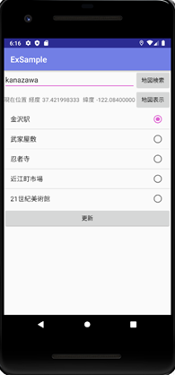
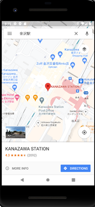

# KanazawaTurismManager
 
KanazawaTurismManagerが何かを簡潔に紹介する
 
# DEMO
 
 
 
# Features
 
上のエディットテキスト欄に観光地などを入力し、地図検索ボタンをタップするとgoogleマップが起動し入力され、検索が行われます。  
地図表示ボタンを押すと座標がgoogleマップに送られ、現在位置を検索します。  
List Viewをタップすると表示されている場所が、googleマップに入力され、検索が行われます。  
更新ボタンをタップするとList Viewの表示が更新されます。

# Requirement
```bash
*import android.Manifest;
*import android.content.Intent;
*import android.content.pm.PackageManager;
*import android.location.Location;
*import android.location.LocationListener;
*import android.location.LocationManager;
*import android.net.Uri;
*import android.os.Bundle;
*import android.util.Log;
*import android.view.View;
*import android.widget.AdapterView;
*import android.widget.ArrayAdapter;
*import android.widget.Button;
*import android.widget.EditText;
*import android.widget.ListView;
*import android.widget.TextView;
*import android.widget.Toast;
*import androidx.appcompat.app.AppCompatActivity;
*import androidx.core.app.ActivityCompat;
*import java.io.UnsupportedEncodingException;
*import java.net.URLEncoder;
*import java.util.ArrayList;
*import java.util.Arrays;
*import java.util.Collections;
*import java.util.List;
```
 
# Installation
 
Requirementで列挙したライブラリなどのインストール方法を説明する

Android Studioをインストールすればライブラリは問題なく使用できます。
 
# Usage
 
Android Studioでまず実機かエミュレーターの設定を行います。次にExSampleファイルをAndroid Studioで開き、そのまま起動する機器を選択して実行をすれば動きます。
 
# Note
 
初めて起動した際に、Android Studioのほうから何かがないなど注意される場合がありますが、基本的には支持通りに動かせば実行には問題が出ないはずです。  
プロキシを挟む場合は、Android Studioのほうでプロキシ設定をしないと、エミュレータがインターネットに接続されずにGoogleマップが開かない問題などが発生するので注意してください。　　
AndroidManifest.xmlの下のほうに、Maps SDK for Android用のAPIキーを作成して入れる部分があるので、自身で作成したAPIキーを入れてください。
 
